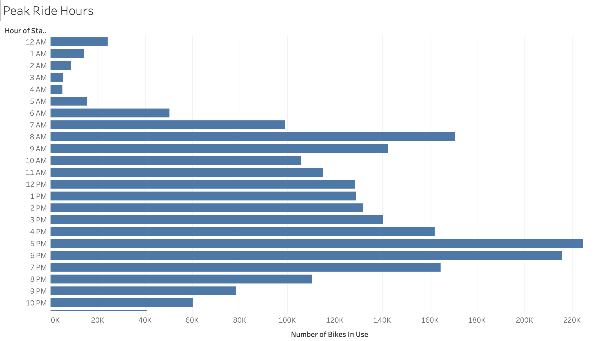
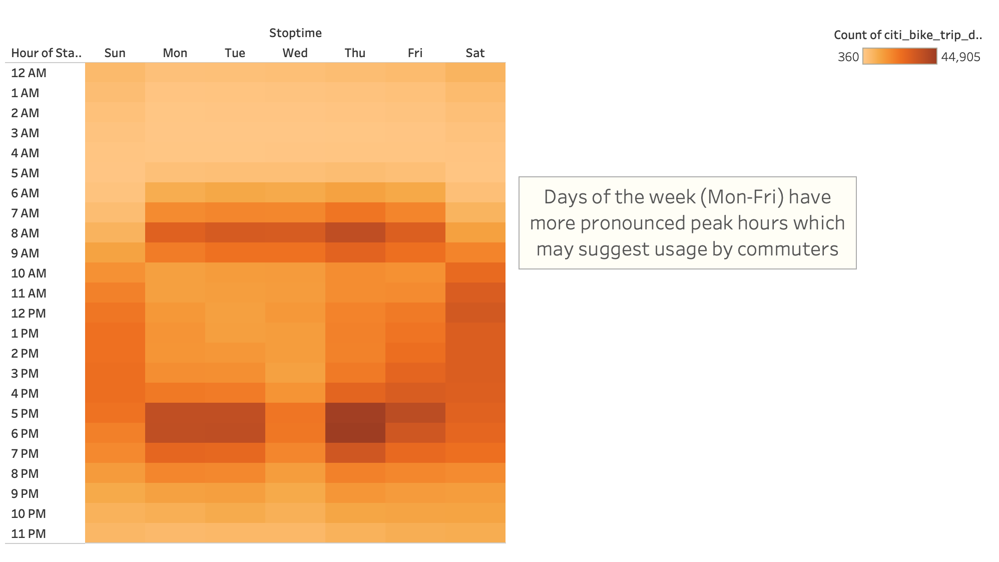
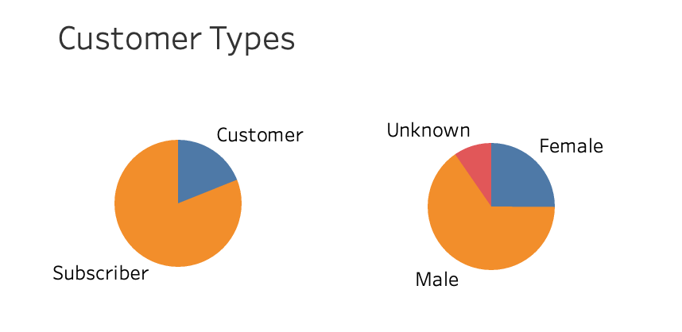
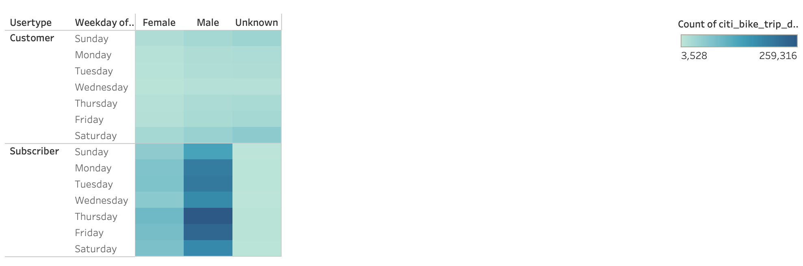
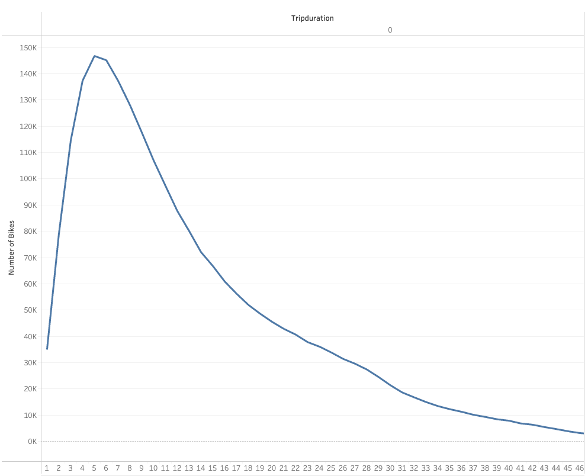
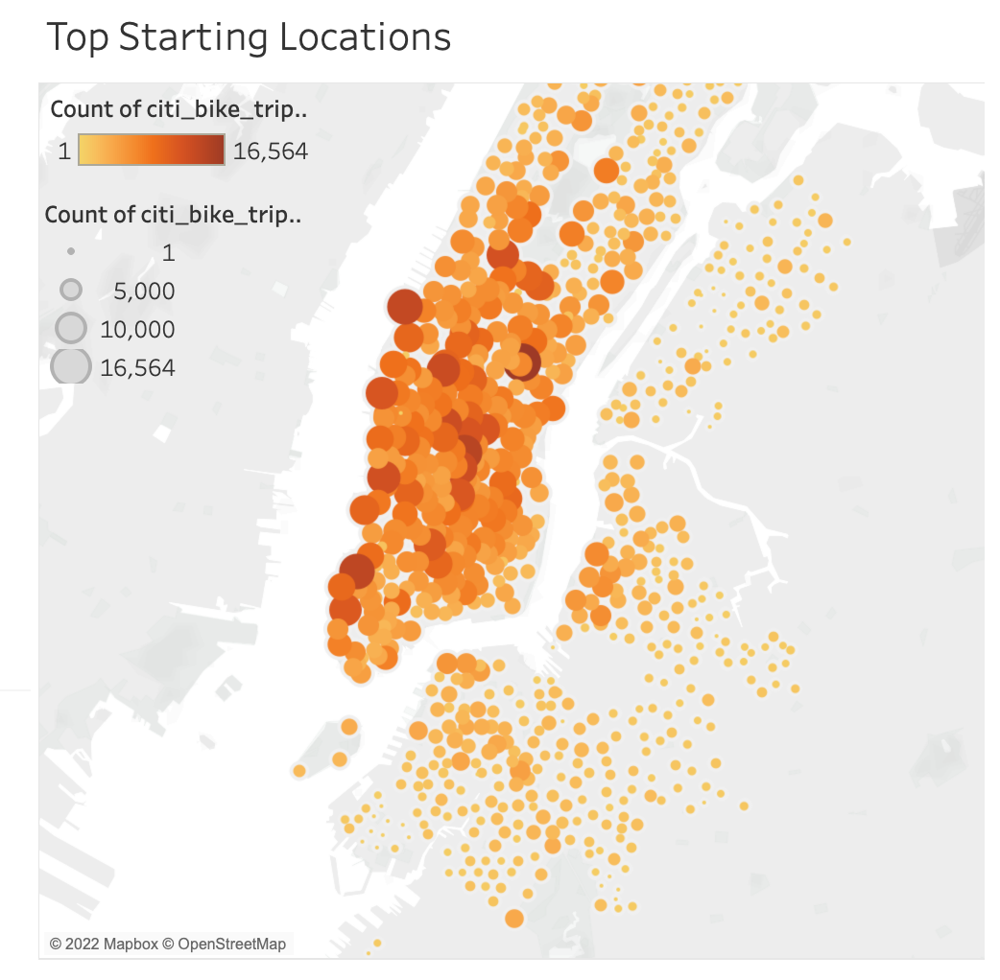
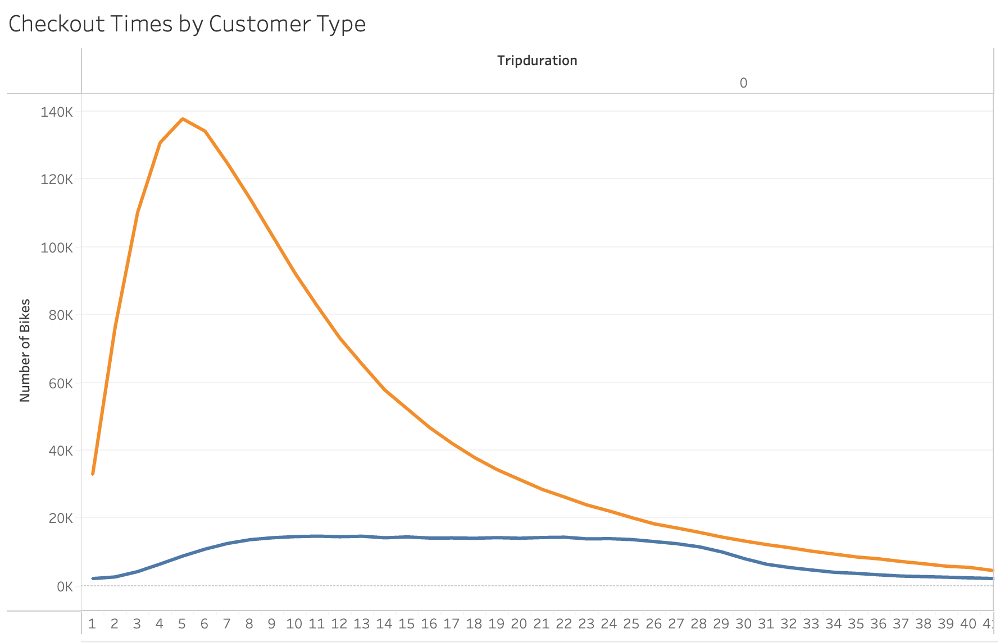

# Visual Analytics for Citi Bike Sharing Business Proposal using Tableau

## Overview of Project
Analysis on for a bike-sharing program in New York City for a business proposal to bring a similar bike-sharing program to Des Moines, Iowa.

## Results
After looking at the Citi Bike data from New York City, some key insights, created with Tableau, will be presented below. For the full Story Board on Talbleau visit:  [link to dashboard](https://public.tableau.com/views/CitiBikeNYCStoryinTableau/NYCCityBikeStory?:language=en-US&publish=yes&:display_count=n&:origin=viz_share_link)

### Figure 1. Peak Ride Hours
Peak ride hours are 8am-10am and 3pm-8pm.

### Figure 2. Peak Ride Hours by Weekday 
When looking a bike usage by weekday those peak ride hours are more pronounced on the weekdays versus the weekend days.

### Figure 3. Customer Types
User base is largely annual subscribers (over 75%) in a city that is a large tourist attraction. Also looking at gender demographics, the majority of users are male.
  
### Figure 4. Peak Ride Times by Weekday, Customer Type, and Gender
Upon further segmentation of week days and customer & gender types, we see that subscribers predominantly use the program during week days and customers use them more on weekends.

### Figure 5. Average Trip Duration
Trip duration shows most rides were less than 30 minutes in duration.

### Figure 6. Top Stations
When looking at the top starting locations, they are primarily located in lower Manhattan, and are all within a 30min bike ride of each other. 

### Figure 7. Average Trip Duration by Customer Type
When looking at average trip duration segmented by user type, we see a larger spread of trip duration with the short term customers.

## Summary
Determining long and short term users, usage by gender, and peak hours has provided a better picture of the demographic using the bike-sharing program. This provides key information for strategic marketing to the right demographics.  The trip duration and top bike start and end locations provide insight that top stations are located in most densely populated areas, and majority of trips are a 30 min bike ride (~ 5 miles) or less.  This is the real crux of the bike sharing program to be successful, do the people of Des Moines have similar commutes of short distances. The comparative analysis with the geographical nature of Des Moines would be needed as well as further analysis a few key areas, specifically weather, traffic, and parking.
